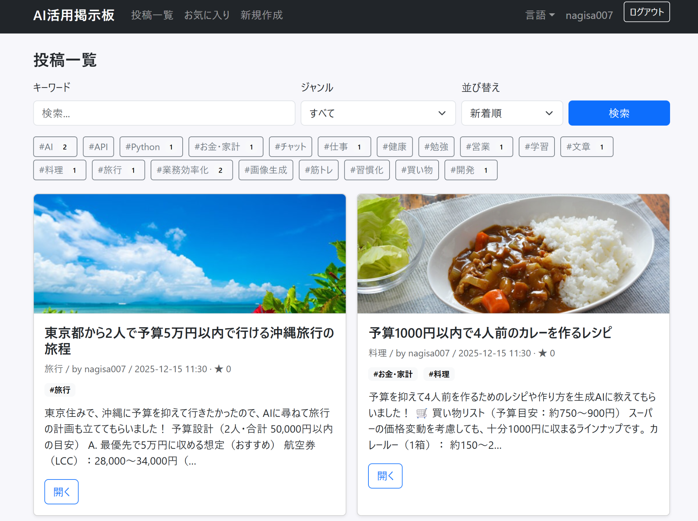

# ai-board（AI活用掲示板）

生成AIの活用事例を「検索できるナレッジ」として蓄積・共有するWebアプリです。  
タグ・検索・お気に入り（いいね）・コメントで、再現性のある業務/私生活ノウハウとして整理できます。

---

## 1. アプリ概要
ai-boardは、生成AIの活用事例（用途・ツール・成果）を投稿・共有できるWebアプリです。  
属人化しがちな「AIの使い方」を、検索・タグ・お気に入り・コメントで整理し、再利用しやすい形にします。  
個人の学習用途だけでなく、チーム内でのナレッジ共有にも使える設計を意識しました。

---

## 2. 解決したい課題
- 生成AIに興味はあるが、何にどう使えば成果が出るか分からない  
- 社内/チームでAI活用の知見が散らばり、再現性が低い（属人化している）  
- 「探せない」「比較できない」ため、結局いつも同じ人しか使いこなせない  
- 日本が国際的なAI活用の波に乗り遅れないようにするためにも、ナレッジ共有の仕組みが必要  

---

## 3. 主な機能
- 投稿：作成 / 一覧 / 詳細表示 / 編集 / 削除（CRUD）
- 検索・絞り込み（キーワード、ジャンル等）
- タグ機能（複数選択・タグ一覧表示）
- コメント機能（返信も含む運用を想定）
- お気に入り（いいね）機能（トグル式）
- ユーザー認証（ログイン）と投稿者の紐付け
- ユーザープロフィール（投稿履歴の表示）
- 画像アップロード（S3連携、サムネ生成/最適化）
- PDF出力（投稿のエクスポート）
- 多言語対応（翻訳ファイル運用：ja など）

---

## 4. スクリーンショット / デモ
- Demo：未デプロイ（ローカルで動作）
- Local Demo：http://127.0.0.1:5000/posts
- GitHub：https://github.com/nagi007-IT/ai-board


## AWS構成図

## AWS構成図

## AWS構成図

```mermaid
flowchart LR
  U[User / Browser] --> EB[AWS Elastic Beanstalk<br/>(Flask App)]

  %% Database is Supabase (outside AWS)
  EB --> DB[(PostgreSQL / Supabase)]

  %% Image storage on AWS
  EB --> S3[(Amazon S3<br/>Image Storage)]

  %% IAM permissions for S3 access
  IAM[IAM Role / Instance Profile<br/>(Least privilege)] -.permits.-> S3
  IAM -.attached to.-> EB

  %% Note: EB runs on managed infra
  EB --> EC2[(EC2 managed by EB)]
```

---

## 5. 技術スタック（＋選定理由）
### Backend
- Python / Flask  
  軽量で構成が明快、学習速度と改修速度を優先。ルーティング/認証/テンプレートの一連を実装しやすい。

### DB
- PostgreSQL（Supabase）  
  SQLiteから移行し、同時アクセスや運用を想定したRDB設計へ。

### Storage
- AWS S3（画像）  
  画像をアプリサーバから分離し、運用・拡張性を確保。

---

## 6. 工夫点（技術的ポイント）
- 「共有したら終わり」にならない情報設計  
  タグ・検索・お気に入り・コメントで “使えるナレッジ” に寄せた
- 認証と権限の基礎設計  
  ユーザーと投稿を紐付け、編集/削除などの操作範囲を整理
- 運用を意識した分離  
  画像はS3へ、環境変数で設定を切り替え可能な構成
- テンプレート共通化（base.html）  
  画面追加・UI調整の保守性を向上
- セキュリティ対策のベース  
  CSRF、レート制限、入力サニタイズ

---

## 7. 課題・改善予定
- テスト整備（pytest等）：重要ロジックの自動テスト化、CI導入
- パフォーマンス/UX：検索最適化、ページング、表示速度改善
- セキュリティ：入力バリデーション強化、監査ログ
- プロダクト化：デモデータ投入、デモモード整備、オンボーディング改善
- AI活用：今後はAPIでAIを連携して、実践的に使われながら改善を繰り返していきたい

---

## 8. 担当範囲
要件整理、技術選定、DB設計、実装（Flask/テンプレート/認証/DB/画像アップロード）、テスト・改善まで一人で実施。

---

## 9. セットアップ（ローカル起動）
### 9.1 依存関係インストール
```bash
python -m venv venv
# Windows
venv\Scripts\activate
pip install -r requirements.txt
